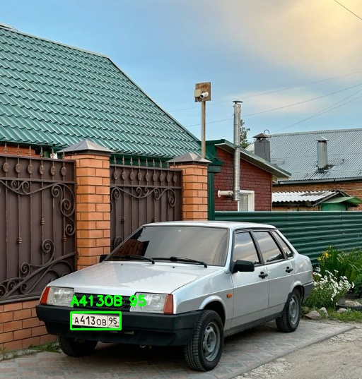
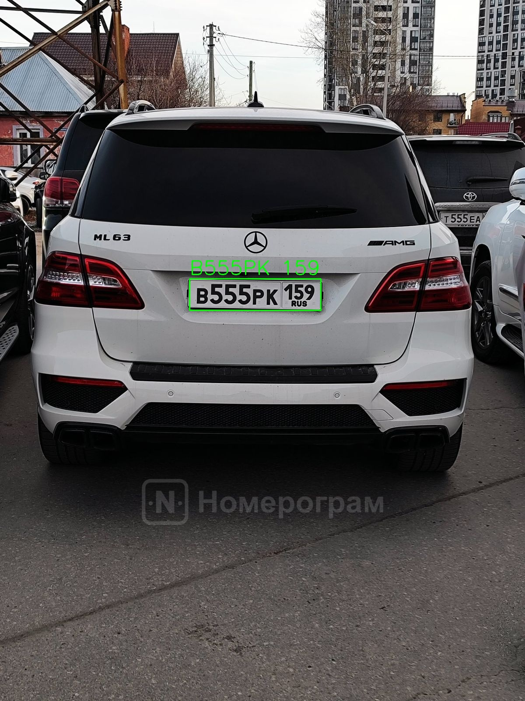
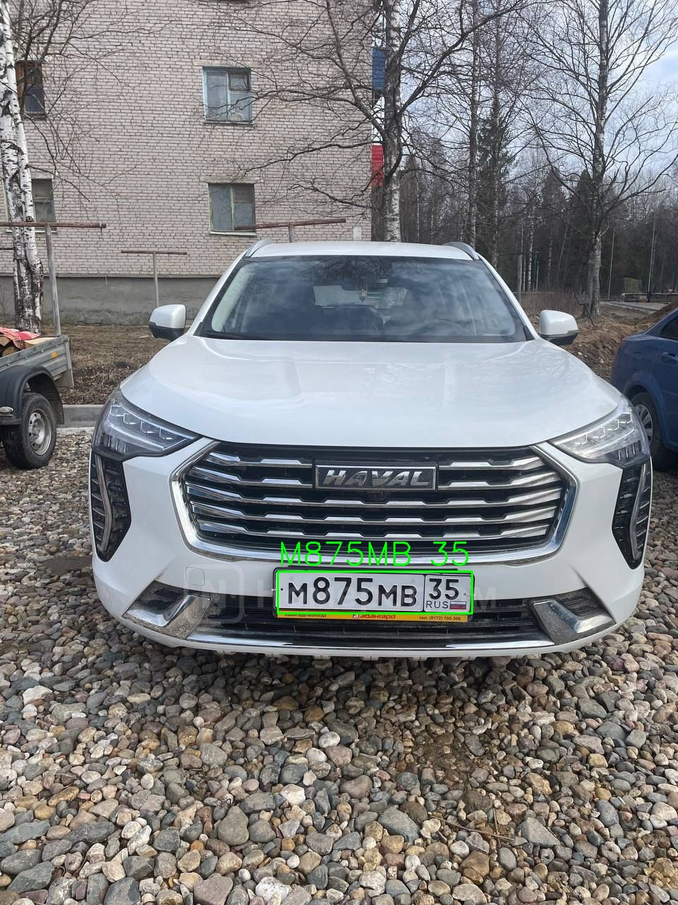
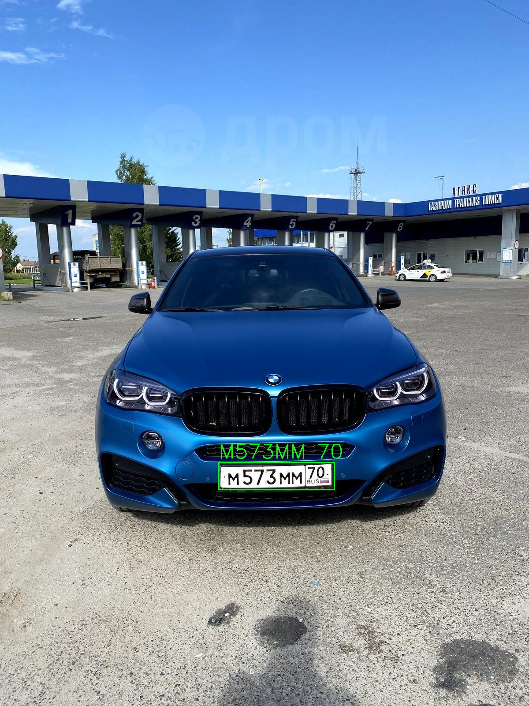
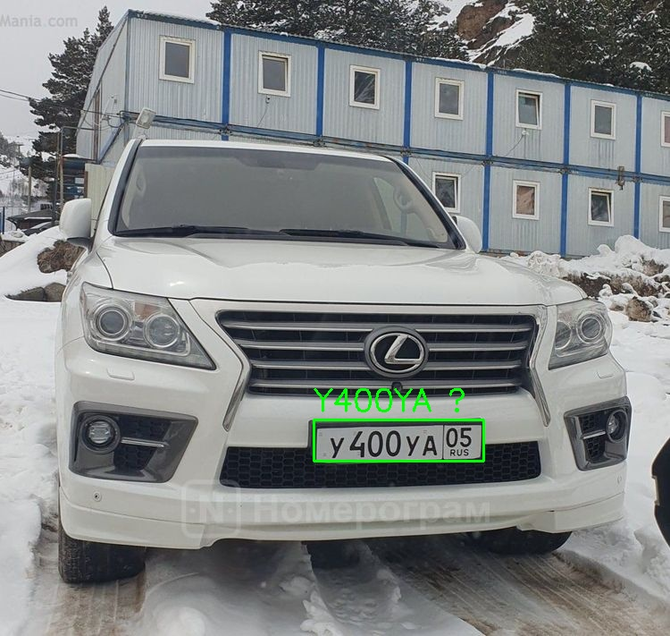
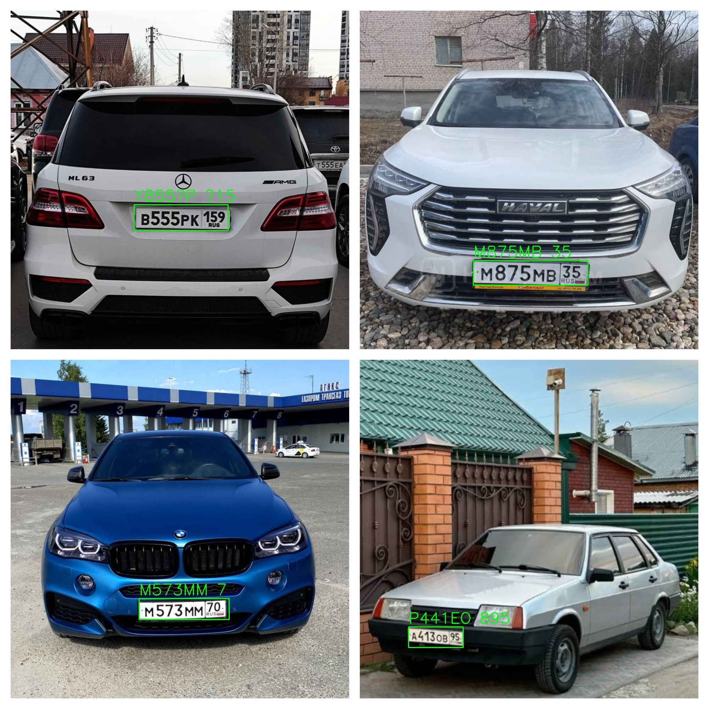

# Обнаружение и распознавание автомобильных номеров

## Цель задания

Разработать Python-приложение, которое:

1. Находит автомобильные номера на изображении;
2. Распознаёт текст с этих номеров (идентификация);
3. Возвращает координаты и распознанные значения в удобной форме (JSON
   или консольный вывод).

---

## Требования к функционалу

1. Входные данные:
    - Изображение (jpeg/png) с одним или несколькими автомобилями.
    - Программа должна работать как с одиночными, так и с пакетами
      изображений (например, из папки).
2. Обнаружение номера:
    - Найти на изображении области, где находятся номерные знаки.
    - Отметить эти области прямоугольниками (bounding boxes).
3. Распознавание текста:
    - Извлечь текст с обнаруженных номерных знаков.
    - Учитывать формат номеров: [A999AA 116] (для РФ) — но также быть
      устойчивым к вариациям.
4. Выходные данные:
    - Вывести в консоль или сохранить в .json файл результат вида:
   ```json
   [
      {
         "filename": "car1.jpg",
         "plates": [
            {
               "box": [
                  x,
                  y,
                  width,
                  height
               ],
               "text": "A123BC 116"
            }
         ]
      }
   ]
   ```
5. Визуализация (по желанию):
    - Отобразить изображение с обведёнными рамками и подписью с
      распознанным текстом.

--- 

## Использованные технологии

Проанализировав предложенные технологии, я выбрал:

- язык python
- обнаружение номеров: [YOLOv8](https://github.com/ultralytics/ultralytics) (Haar Cascades - много ложных срабатываний,
  MMDetection - избыточен для этой задачи)
- распознавание текста: [Tesseract](https://github.com/tesseract-ocr/tesseract)
- работа с изображениями: [OpenCV](https://github.com/opencv/opencv), [Pillow](https://github.com/python-pillow/Pillow)

---

## Установка

С помощью пакетного менеджера [uv](https://docs.astral.sh/uv/)

Установка [uv](https://docs.astral.sh/uv/getting-started/installation/)

Установка [Tesseract](https://github.com/tesseract-ocr/tesseract)

Далее необходимо установить зависимости:

```bash
make install
```

Запуск приложения:

```bash
make run
```

При запуске будет предложено ввести путь к изображению или папке:

```bash
Введите путь к изображению или папке:
```

Примеры ввода:
- Путь к одному изображению: `data/images/car1.png`
- Путь к папке с изображениями: `data/images/`

Далее результат будет сохраняться в виде JSON и изображения с рамками в `data/results/`.

---

## Результат работы приложения

Все результаты сохраняются в директории `data/results/`:

Во время работы приложения может наблюдаться ситуация, при которой модель не всегда корректно обнаруживает автомобильный номер или некачественно распознаёт текст на нём. Это связано с рядом факторов, которые влияют как на этапе детекции, так и на этапе OCR-распознавания.

Возможные причины неточностей:
- Низкое качество изображения
- Посторонние объекты или фон
- Особенности шрифта и формата номера
- Ошибки OCR (Tesseract)
- Ограниченная обучающая выборка

### car1.png



```json
[
  {
    "filename": "car1.png",
    "plates": [
      {
        "box": [
          100,
          442,
          70,
          24
        ],
        "text": "A413OB 95"
      }
    ]
  }
]
```

### car2.png



```json
[
  {
    "filename": "car2.png",
    "plates": [
      {
        "box": [
          433,
          636,
          300,
          72
        ],
        "text": "B555PK 159"
      }
    ]
  }
]
```

### car3.png



```json
[
  {
    "filename": "car3.png",
    "plates": [
      {
        "box": [
          393,
          808,
          275,
          59
        ],
        "text": "M875MB 35"
      }
    ]
  }
]
```

### car4.png



```json
[
  {
    "filename": "car4.png",
    "plates": [
      {
        "box": [
          496,
          1048,
          262,
          61
        ],
        "text": "M573MM 70"
      }
    ]
  }
]
```

### car8.png



```json
[
  {
    "filename": "car8.png",
    "plates": [
      {
        "box": [
          351,
          469,
          190,
          46
        ],
        "text": "Y400YA ?"
      }
    ]
  }
]
```

### combined.png



```json
[
  {
    "filename": "combined.png",
    "plates": [
      {
        "box": [
          1335,
          735,
          323,
          69
        ],
        "text": "M875MB 35"
      },
      {
        "box": [
          378,
          577,
          265,
          73
        ],
        "text": "Y855?P ?15"
      },
      {
        "box": [
          392,
          1688,
          254,
          59
        ],
        "text": "M573MM 7"
      },
      {
        "box": [
          1152,
          1768,
          154,
          58
        ],
        "text": "P441EO 895"
      }
    ]
  }
]
```